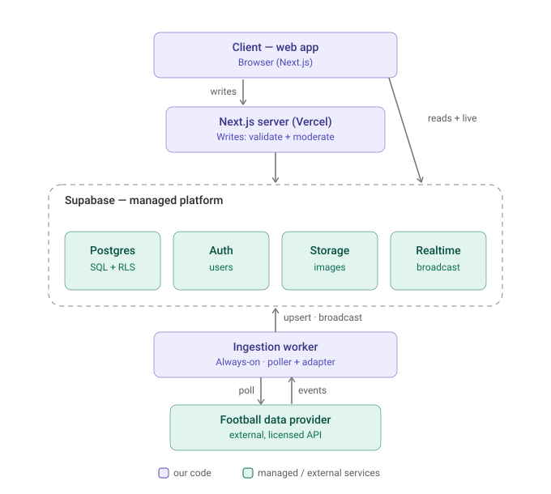
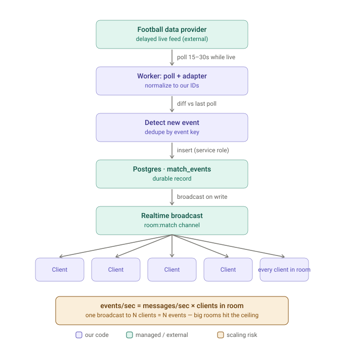

# Backend & Technical Architecture — Live Football Social Platform

## v0.1 (MVP / Phase 1) — Draft for review

**Status:** Draft. Derived from `PRD v1.0`. Not a final architecture — every component choice below is a *recommendation pending human sign-off*, per the open decisions in §14.
**Depends on:** Resolution of PRD §12 open decisions (especially the cold-start motion), which materially change realtime sizing and hosting.
**Scope:** MVP surface only (PRD §8). Phase 2/3 items are noted as forward-compatibility constraints, not built here.

> ⚠️ Read this alongside the PRD, not instead of it. Where this doc names specific vendor limits or prices, treat them as *inputs to verify at decision time*, not settled facts — they change, and the free-tier caveats below are the kind of thing that quietly breaks a launch.

---

## 1. Guiding constraints (what shapes every decision below)

1. **Solo/small team, web-first.** Favour managed services over self-hosted infra. Every component we run ourselves is a component we have to operate at 2am during a marquee match.
2. **The core hypothesis is about live participation** (PRD §3). The realtime path (event ingestion → fan-out → chat) is the highest-risk, highest-value part of the system and gets the most design attention here.
3. **Provider independence is non-negotiable** (PRD §11). All football data flows through one adapter with our own IDs, so a provider swap is config, not a migration.
4. **Moderation ships in MVP, not later** (PRD §8.6, §14). The write path for messages must have report/mute/word-filter/rate-limit hooks from day one.
5. **Not a gambling product.** Predictions (Phase 2) are entertainment mechanics — no stakes, no payouts, no money movement anywhere in the system.

---

## 2. High-level architecture



*The rendered diagram above is the reference; the ASCII version below is a plain-text fallback for viewers that don't display the SVG.*

```
                         ┌─────────────────────────────────────────────┐
                         │                 Clients                     │
                         │   Next.js web app (browser)                 │
                         │   - reads: direct Supabase client (w/ RLS)  │
                         │   - writes: server actions / route handlers │
                         │   - realtime: WebSocket to Supabase Realtime│
                         └───────────────┬─────────────────────────────┘
                                         │
              ┌──────────────────────────┼───────────────────────────────┐
              │                          │                               │
     ┌────────▼─────────┐      ┌─────────▼──────────┐          ┌─────────▼─────────┐
     │  Next.js server  │      │  Supabase          │          │ Supabase Realtime │
     │  (Vercel)        │      │  - Postgres + RLS  │◄─────────►│  (Broadcast /     │
     │  - server actions│─────►│  - Auth            │  channel  │   Presence)       │
     │  - validation    │      │  - Storage (images)│  events   │                   │
     │  - moderation    │      └─────────▲──────────┘          └───────────────────┘
     └──────────────────┘                │
                                         │ writes matches/events (service role)
                         ┌───────────────┴───────────────┐
                         │  Ingestion worker (always-on)  │
                         │  - polls provider on a schedule│
                         │  - diffs → detects new events  │
                         │  - writes to DB + broadcasts   │
                         │  ┌──────────────────────────┐  │
                         │  │  Provider adapter layer  │  │
                         │  └────────────┬─────────────┘  │
                         └───────────────┼────────────────┘
                                         │ HTTPS (API key, server-side only)
                                ┌────────▼─────────┐
                                │ Football data    │
                                │ provider (e.g.   │
                                │ football-data.org│
                                │ → paid tier)     │
                                └──────────────────┘
```

**The one structural point to internalise:** the browser talks to Supabase *directly* for reads (guarded by Row-Level Security) and for the realtime socket. We do **not** build our own WebSocket server. The only bespoke backend process is the **ingestion worker**, because polling a third-party API on a schedule is a long-running job that doesn't fit serverless cleanly (see §5).

---

## 3. Component choices (recommended, pending §14 sign-off)

| Concern | Recommendation | Why | Main alternative |
|---|---|---|---|
| Web framework | Next.js (App Router) on Vercel | PRD-selected; server actions cover the write path; preview deploys per PR | Remix, SvelteKit |
| DB / Auth / Storage | Supabase (Postgres, Auth, Storage) | One managed platform; RLS gives us authz at the data layer; PRD-selected | Neon + Clerk + separate object store |
| Realtime chat | Supabase Realtime **Broadcast** (private channels) | Lowest-friction path that scales further than Postgres-Changes; see §6 | Ably / Pusher (managed) or self-hosted socket service |
| Event ingestion | Small **always-on worker** (Railway / Fly.io / Render) | Needs a persistent, sub-minute loop holding a secret key; poor serverless fit | Vercel Cron (1-min granularity) or Supabase scheduled Edge Functions |
| Validation | `zod` schemas on every server action / route handler | One validation contract shared client/server | — |
| Error tracking | Sentry (client + server + worker) | Already in the team's toolchain; catches worker failures | — |

Nothing here is locked. The two choices that deserve the most scrutiny before building are the **ingestion worker host** and the **realtime approach**, because both change if the launch is marquee-event rather than single-club (§14).

---

## 4. Data model (illustrative — review before applying)

This is a starting schema for the MVP surface, not a final migration. Column types are indicative. Every table has RLS enabled; the policy intent is summarised after the DDL.

```sql
-- ---------- identity & reference ----------
create table profiles (
  id           uuid primary key references auth.users(id) on delete cascade,
  username     text unique not null,
  club_id      bigint references clubs(id),        -- mandatory at signup (enforced in app + check)
  country_code text,
  avatar_url   text,
  created_at   timestamptz not null default now()
);

create table competitions (
  id            bigserial primary key,
  provider_ref  text not null,                     -- external id, via adapter
  name          text not null,
  country_code  text,
  unique (provider_ref)
);

create table clubs (
  id             bigserial primary key,
  competition_id bigint references competitions(id),
  name           text not null,
  short_name     text,
  primary_color  text,                             -- used for profile theming; NOT the crest
  secondary_color text,
  provider_ref   text,
  unique (provider_ref)
);

create table teams (                               -- the on-pitch entity the provider reports
  id            bigserial primary key,
  club_id       bigint references clubs(id),
  provider_ref  text not null unique,
  name          text not null
);

-- ---------- matches & events (written by the worker) ----------
create table matches (
  id             bigserial primary key,
  provider_ref   text not null unique,
  competition_id bigint references competitions(id),
  home_team_id   bigint references teams(id),
  away_team_id   bigint references teams(id),
  kickoff_at     timestamptz not null,
  status         text not null,                    -- SCHEDULED | LIVE | PAUSED | FINISHED ...
  minute         int,
  home_score     int,
  away_score     int,
  last_polled_at timestamptz,
  updated_at     timestamptz not null default now()
);
create index on matches (status, kickoff_at);

create table match_events (
  id                 bigserial primary key,
  match_id           bigint not null references matches(id) on delete cascade,
  type               text not null,                -- GOAL | CARD | SUB | ...
  minute             int,
  team_id            bigint references teams(id),
  player_name        text,
  payload            jsonb not null default '{}',
  provider_event_key text not null,                -- idempotency: dedupe re-polled events
  created_at         timestamptz not null default now(),
  unique (match_id, provider_event_key)
);

-- ---------- live rooms & chat ----------
create table chat_rooms (
  id         bigserial primary key,
  match_id   bigint not null references matches(id) on delete cascade,
  type       text not null default 'global',       -- MVP: one 'global' room per match
  created_at timestamptz not null default now(),
  unique (match_id, type)
);

create table messages (
  id         bigserial primary key,
  room_id    bigint not null references chat_rooms(id) on delete cascade,
  user_id    uuid not null references profiles(id),
  body       text not null,
  created_at timestamptz not null default now(),
  deleted_at timestamptz                            -- soft-delete for moderation
);
create index on messages (room_id, created_at desc);

create table reactions (
  message_id bigint not null references messages(id) on delete cascade,
  user_id    uuid not null references profiles(id),
  emoji      text not null,
  primary key (message_id, user_id, emoji)
);

-- ---------- community feed ----------
create table posts (
  id         bigserial primary key,
  author_id  uuid not null references profiles(id),
  club_id    bigint not null references clubs(id),  -- which community feed it belongs to
  body       text,
  image_url  text,
  created_at timestamptz not null default now(),
  deleted_at timestamptz
);
create index on posts (club_id, created_at desc);

create table comments (
  id         bigserial primary key,
  post_id    bigint not null references posts(id) on delete cascade,
  author_id  uuid not null references profiles(id),
  body       text not null,
  created_at timestamptz not null default now(),
  deleted_at timestamptz
);

create table likes (
  post_id bigint not null references posts(id) on delete cascade,
  user_id uuid not null references profiles(id),
  primary key (post_id, user_id)
);

create table follows (
  follower_id uuid not null references profiles(id),
  followee_id uuid not null references profiles(id),
  created_at  timestamptz not null default now(),
  primary key (follower_id, followee_id),
  check (follower_id <> followee_id)
);

-- ---------- match log (single-player value) ----------
create table match_logs (
  id         bigserial primary key,
  user_id    uuid not null references profiles(id),
  match_id   bigint not null references matches(id),
  watched    boolean not null default true,
  rating     smallint check (rating between 0 and 10),
  note       text,
  created_at timestamptz not null default now(),
  unique (user_id, match_id)
);

-- ---------- moderation ----------
create table reports (
  id          bigserial primary key,
  reporter_id uuid not null references profiles(id),
  target_type text not null,                        -- 'message' | 'post' | 'comment'
  target_id   bigint not null,
  reason      text,
  status      text not null default 'open',         -- open | reviewed | actioned
  created_at  timestamptz not null default now()
);

create table mutes (
  muter_id uuid not null references profiles(id),
  muted_id uuid not null references profiles(id),
  primary key (muter_id, muted_id)
);

create table blocked_words (                         -- word filter source of truth
  word text primary key
);

-- ---------- Phase 2 (defined now for forward-compat, built later) ----------
create table predictions (
  id         bigserial primary key,
  user_id    uuid not null references profiles(id),
  match_id   bigint not null references matches(id),
  home_pred  int not null,
  away_pred  int not null,
  points     int,                                    -- null until resolved post-match
  created_at timestamptz not null default now(),
  unique (user_id, match_id)                         -- lock enforced in app: reject writes after kickoff
);
```

**RLS policy intent (the authorization backbone — do not rely on client checks):**

- `profiles`, `posts`, `comments`, `messages`, `match_logs`, `predictions`: readable per the visibility rules (community/public), but **insert/update/delete only where `user_id = auth.uid()`**.
- Reference tables (`clubs`, `competitions`, `teams`, `matches`, `match_events`): read-only to clients; writes restricted to the service role (the worker).
- `reports`: a user can insert their own reports and read only their own; moderation review happens through the service role / an internal tool.
- `mutes`, `likes`, `follows`, `reactions`: scoped to the acting user.
- `messages`/`posts`/`comments` reads should exclude `deleted_at is not null` for normal users.

RLS is evaluated **per row per query**, and (relevant to §6) **once per subscriber per event** on Realtime — so keep policies cheap (indexed equality checks), not subqueries across large tables.

---

## 5. Live data ingestion (the part that isn't "just Vercel + Supabase")

### 5.1 Why a dedicated worker

Polling a provider every ~30–90s, diffing responses, and writing events is a **persistent loop that holds a secret API key and the Supabase service-role key**. Serverless functions are a poor fit: they're short-lived, stateless, and cold-start. Options, with the trade-off:

| Option | Pros | Cons |
|---|---|---|
| **Always-on worker** (Railway / Fly.io / Render) — *recommended* | Sub-minute cadence, keeps state (last-seen events) warm, natural home for the adapter | One more service to run/pay for (~a few $/mo) |
| Vercel Cron → serverless poll | No extra platform | ~1-min minimum granularity; cold starts; no in-memory diff state |
| Supabase scheduled Edge Functions + `pg_cron` | Stays inside Supabase | Cron granularity; diff/idempotency logic in SQL/Deno is more awkward |

**Recommendation (pending §14):** a single small always-on worker for MVP. It is stateless enough to redeploy freely; all durable state lives in Postgres.

### 5.2 Poll loop

- Poll **one centralized "live matches" call** per cycle, not one call per match — this returns all in-play games at once, so provider rate limits are effectively per-app regardless of audience size (PRD §11).
- Cadence: adaptive. Poll faster (e.g. ~15–30s) while any match in a covered competition is `LIVE`; back off to minutes when nothing is live. This respects the rate cap and saves quota.
- **Idempotency:** every event carries a stable `provider_event_key`; the `unique (match_id, provider_event_key)` constraint makes re-ingesting the same poll a no-op. Never assume the provider only sends an event once.
- On each cycle: upsert match state (score, minute, status) → detect newly-appeared events → insert them → broadcast (see §6.3).

### 5.3 ⚠️ The latency reality (verify before promising an SLA)

The free football-data.org tier is **10 requests/minute and delivers *delayed* scores** for the 12 free competitions; un-delayed live data is a paid add-on. So the match-page latency budget in PRD §8.2/§16 is bounded by **the provider's own delay plus our poll cadence**, not by our infra. On free tier this can be tens of seconds to minutes.

Product consequence to flag now: **fans in the room will know about a goal (from the TV) before our event marker appears.** The chat will erupt with "GOAL!!!" seconds before the inline marker lands. That's not a bug we can engineer away on a polling+delayed feed — it's a reason to (a) budget for the paid livescores add-on before launch, or (b) evaluate a provider offering push/webhooks/SSE so events arrive on change instead of on poll. Either path is a config swap behind the adapter (§7).

---

## 6. Realtime chat architecture (the highest-risk section)

### 6.1 Why not Postgres Changes for chat

Supabase Realtime can stream table inserts (`messages`) to subscribers, but it runs **RLS once per subscriber per event** and goes through Postgres replication. For a busy room that becomes the bottleneck. Reserve Postgres-Changes for low-volume signals; use **Broadcast** for the chat stream.

### 6.2 Recommended pattern: Broadcast + persist

- Each match room is a **private Realtime channel** (e.g. `room:match_<id>`), gated by Realtime Authorization (RLS on the realtime messages table) so only authenticated users can subscribe/publish.
- **Message send path:** client calls a server action → we validate (`zod`), run moderation hooks (§8), `insert` into `messages`, and broadcast the message to the channel. Persisting and broadcasting are both needed: the table is the history/roll-up artifact (PRD §9), the broadcast is the live delivery.
- **Participant count:** use **Presence** sparingly — it has tight limits (a client can send only ~5 presence updates per 30s window, and there's a project-wide presence-events/sec cap). For a big room, prefer a throttled, server-computed count broadcast periodically over raw per-client presence.
- **Event markers:** the worker (§5) broadcasts goal/card/sub events onto the same channel so they interleave with chat, exactly as PRD §8.3 requires.

### 6.3 ⚠️ Fan-out math — the ceiling that bites at scale

Supabase counts **each delivered message as one "event": one broadcast to N subscribers = N events.** So for a single room:

```
events/sec ≈ (messages posted per second) × (connected clients in room)  + presence/event-marker overhead
```

Plan limits to size against (**verify current numbers at decision time**):

| Plan | Concurrent clients | Messages/sec (events) |
|---|---|---|
| Free | ~200 | ~100 |
| Pro (with spend cap) | ~500 | ~500 |
| Pro (no spend cap) / Team | ~10,000 | ~2,500 |

Worked example: a marquee room with **2,000 concurrent viewers** and just **5 messages/sec** posted = **10,000 events/sec** — ~4× the 2,500 ceiling. Big rooms saturate *throughput* long before they saturate *connections*.



*One goal event's path from the provider out to every fan in the room. The amber note is the fan-out ceiling: a single broadcast costs one event per connected client, so the same diagram explains chat messages too — they share this multiplier.*

**Implications & mitigations (decision-gated on the §14 cold-start choice):**
- A **single-club launch** keeps rooms small; Supabase Realtime on Pro is very likely sufficient for MVP.
- A **marquee-event launch** (World Cup / El Clásico) creates exactly the mega-rooms that break the fan-out math on day one. Mitigations, in rough order: (1) rate-limit posting per user; (2) coalesce/batch server-side and don't deliver every message to every client in huge rooms (sample/throttle the rendered stream); (3) move mega-rooms to a dedicated broadcast layer (Ably/Pusher or self-hosted) behind the same client interface. This is the concrete architectural reason the cold-start decision can't be deferred past this doc.

---

## 7. Provider adapter layer (isolation is the whole point)

- One module, one responsibility: translate provider payloads ↔ our internal `matches`/`teams`/`match_events` shapes using **our own IDs**. Nothing outside this module knows the provider's field names.
- Interface (illustrative): `listLiveMatches()`, `getMatch(providerRef)`, `listFixtures(window)`, each returning our internal types.
- A stable mapping table (`provider_ref` columns) links external IDs to ours, so re-mapping on a provider swap is a data task, not a schema change.
- This is what makes the free-tier→paid-tier→different-provider path (PRD §11, and the latency fix in §5.3) a **configuration change**. Guard it with contract tests against recorded provider fixtures so a provider swap can be validated offline.

---

## 8. Moderation (in the write path from day one — PRD §8.6)

Moderation must sit **on the message/post insert path**, not be a later add-on:

- **Word filter:** check `body` against `blocked_words` before insert (in the server action, or a `before insert` trigger). Reject or soft-flag.
- **Rate limiting:** cap messages/minute per user (target number TBD in PRD §8.3). Enforce server-side — a counter in Postgres or a lightweight token-bucket at the edge. Do not trust the client.
- **Report:** inserts a `reports` row and immediately hides the target for the reporter (client-side filter backed by the row); flags for review.
- **Mute:** a `mutes` row; muted users' messages are filtered out for the muter on read and on the live stream.
- **Soft-delete:** moderation hides via `deleted_at` rather than hard delete, preserving an audit trail. (Hard deletion, if ever needed, is a deliberate, human-approved operation — not something automated.)

Rivalry rooms (Phase 3) raise the toxicity ceiling; per PRD §14 their rules get human review *before* they ship. Nothing in MVP should make that harder to add later.

---

## 9. Security (measures to implement — this is not a claim the system is secure)

A security review against the OWASP Top 10 should be run before launch. Baseline measures:

- **Authorization = RLS, everywhere.** Every table has RLS enabled with default-deny; access is granted by explicit policy. Client-side checks are UX only, never a security boundary.
- **Key hygiene.**
  - The Supabase **anon key is public** and safe *only because RLS is on* — treat RLS as load-bearing, not optional.
  - The **service-role key** and the **provider API key** live **only** in the worker / server environment. They must never be bundled to the client (no `NEXT_PUBLIC_` prefix, ever) and never appear in logs.
- **Secrets management.** Environment variables via the platform's secret store (Vercel project env, worker platform secrets, Supabase Vault for DB-side secrets). **No secrets in the repo**; `.env*` is git-ignored; if a secret is ever committed, rotate it, don't just delete the commit. This aligns with the org policy of never handling `.env`, keys, or credentials in plaintext.
- **Input validation.** `zod` on every server action and route handler; reject unknown fields. Validate image uploads by MIME/type and size; consider stripping EXIF; store in a bucket with least-privilege policies and serve via signed URLs.
- **Abuse & spam.** Rate-limit signups and message posting; keep the door open for a CAPTCHA/attestation on signup if bots appear. (We implement bot *defenses*; we never build anything to defeat someone else's bot-detection.)
- **PII minimisation.** We hold little PII (email via Supabase Auth, username). Keep it that way; don't log it; don't put it in analytics events.
- **Realtime authorization.** Use **private channels** with RLS-backed authorization so a user can't subscribe to arbitrary channels or spoof broadcasts using the public anon key.
- **Dependencies.** Prefer maintained, security-reviewed libraries; check new dependencies against the org's approved-software process and raise an IT/Security request for anything not already approved before adding it.

---

## 10. API / access surface (MVP)

Most **reads** are direct Supabase client queries from the browser, constrained by RLS (match lists, feed, profile, logs). **Writes that need validation or moderation** go through Next.js server actions / route handlers:

- Auth: handled by Supabase Auth (email + optional OAuth).
- `createPost`, `createComment`, `toggleLike`, `toggleFollow`
- `sendMessage` (validation + moderation + persist + broadcast), `addReaction`
- `logMatch` (upsert into `match_logs`), `rateMatch`
- `reportContent`, `muteUser`
- Phase 2: `submitPrediction` (rejects writes after `kickoff_at`)
- Worker-only (service role, not exposed): match/event upserts, broadcast of event markers.

---

## 11. Environments, CI/CD, and change management

Aligned to the org's production practices (feature branches, review, CI, staging before prod; no direct prod changes):

- **Repo layout:** `apps/web` (Next.js), `apps/worker` (ingestion), `supabase/migrations` (versioned SQL), `supabase/seed` (clubs/competitions reference data).
- **Branching:** feature branch → PR → **≥1 peer approval** → CI (lint, typecheck, unit/integration tests, migration dry-run) → merge → auto-deploy to **staging** → manual promotion to **prod**.
- **Databases:** separate Supabase projects (or Supabase branching) for **staging** and **prod**. Migrations are code, applied via the Supabase CLI in CI — **never hand-edited in the prod dashboard.**
- **Preview envs:** Vercel preview deploy per PR, wired to the staging Supabase project (never prod).
- **Migration safety:** use the **expand/contract** pattern (add columns/tables backward-compatibly, migrate, then remove) so a bad app deploy can be rolled back *without* a destructive DB rollback. **Snapshot/backup before each prod migration.** Prefer forward-fixes over down-migrations. Any destructive migration (dropping columns/tables) is called out in the PR and gets explicit human approval.
- **Seed data:** clubs, competitions, and their colours are seeded and versioned so environments are reproducible.

---

## 12. Observability & ops

- **Errors:** Sentry across client, server actions, and the worker — worker failures are otherwise invisible and would silently kill the live feed.
- **Structured logs:** no secrets, no PII. Log provider-poll outcomes, event-ingest counts, moderation actions.
- **Metrics to instrument from day one** (supports PRD §13): % of users active during a live match, messages/reactions/predictions per live session, room concurrency, poll→marker latency, provider error rate, and Realtime throttle errors (`tenant_events`, `too_many_connections`) as an early-warning that we're approaching the fan-out ceiling.
- **Alerts:** worker down / poll failing, provider error spike, Realtime throttling, error-rate spike. Size alert thresholds against the launch motion chosen in §14.

---

## 13. Scaling & cost notes

- **Connection pooling:** front Postgres with **Supavisor in transaction mode** so bursts of serverless invocations don't exhaust DB connections.
- **Cache the hot reads:** the live-matches list is identical for every viewer — cache it (short TTL) so one provider poll serves the whole audience; this is what keeps provider limits per-app (PRD §11).
- **Realtime is the first thing to break, not the DB.** Watch the §6.3 fan-out ceiling before worrying about Postgres.
- **Cost checkpoints to verify at decision time:** football-data.org paid/live add-on vs. an alternative provider with push/webhooks; Supabase Pro (and whether a spend cap is acceptable given it caps realtime throughput); the worker host. Don't take the numbers in this doc as current.

---

## 14. Open architecture decisions requiring human approval

These block or reshape the build and should be decided deliberately, not by whoever writes the first migration. The first two are downstream of PRD §12's cold-start decision.

1. **Ingestion worker host** — adds a component beyond "Vercel + Supabase." Recommend a small always-on worker (§5). *Approve the added service and its platform.*
2. **Realtime approach vs. launch motion** — Supabase Realtime (Pro) is fine for a **single-club** launch; a **marquee-event** launch likely forces posting rate-limits + a dedicated broadcast layer for mega-rooms from day one (§6.3). *This is the same decision as PRD §12.1 wearing an engineering hat — decide together.*
3. **Data provider / latency tier** — the free tier delivers **delayed** scores (§5.3). Decide between the paid livescores add-on and a push/webhook-capable provider *before* setting any latency expectation in `user-flows.md`.
4. **Message delivery pattern** — broadcast-from-database trigger vs. app-level dual-write (persist + broadcast). Recommend app-level for explicit moderation control; confirm.
5. **Environment topology** — separate staging/prod Supabase projects vs. Supabase branching, and the region (put DB + worker + realtime in the same region as the launch audience to cut latency).

---

## 15. Backend-specific risks

| Risk | Mitigation |
|---|---|
| Realtime fan-out ceiling during marquee matches | Rate-limit posting; coalesce/sample delivery in huge rooms; dedicated broadcast layer for mega-rooms (§6.3); alert on throttle errors |
| "Fans know before the marker" (delayed/polled feed) | Paid live add-on or push/webhook provider (§5.3); set honest latency expectations in UX copy |
| Worker is a single point of failure for the live feed | Keep it stateless + auto-restart; Sentry alerting; health-check; all durable state in Postgres so a redeploy is safe |
| Provider lock-in / schema drift | Adapter layer + contract tests against recorded fixtures (§7) |
| RLS mistake exposes data (anon key is public) | Default-deny RLS, policy tests in CI, security review before launch (§9) |
| Serverless connection exhaustion | Supavisor transaction-mode pooling (§13) |
| Secret leakage into client bundle or logs | Server/worker-only keys, no `NEXT_PUBLIC_` on secrets, log scrubbing, rotate-on-exposure (§9) |

---

## 16. Suggested build sequence (MVP)

1. **M0 — Foundations:** repo, Supabase projects (staging/prod), CI, auth, `profiles` + mandatory club selection, RLS baseline + policy tests.
2. **M1 — Reference data + adapter:** competitions/clubs/teams seed; adapter with contract tests against recorded fixtures.
3. **M2 — Ingestion worker:** poll loop, idempotent event ingest, match-state upserts (no realtime yet).
4. **M3 — Match pages:** discovery list, match page with Stats/Lineups tabs from stored data.
5. **M4 — Live room:** Broadcast channel, send path with validation + moderation hooks, event markers interleaved, participant count.
6. **M5 — Community feed + match log:** posts/comments/likes/follows; one-tap watched + rating.
7. **M6 — Hardening:** rate limits, report/mute end-to-end, observability, load test the §6.3 fan-out against the chosen launch motion, security review.

---

## 17. Assumptions & things to verify before building

- Vendor limits and prices in this doc (Supabase Realtime caps, football-data.org tiers/add-ons) are **as-researched and must be re-verified at decision time.**
- The free provider tier's **delayed** scores are assumed acceptable only for prototyping, not launch.
- MVP is assumed to be a **single global room per match** (PRD §12.2 recommendation); richer room taxonomy is explicitly out of scope here.
- Predictions are Phase 2; the `predictions` table is defined only for forward-compatibility.
- Next.js + Supabase is inherited from the PRD as the current recommendation and should be **re-confirmed once §14/PRD-§12 are resolved**, since a marquee-event launch with spiky concurrency could justify a different realtime substrate.
